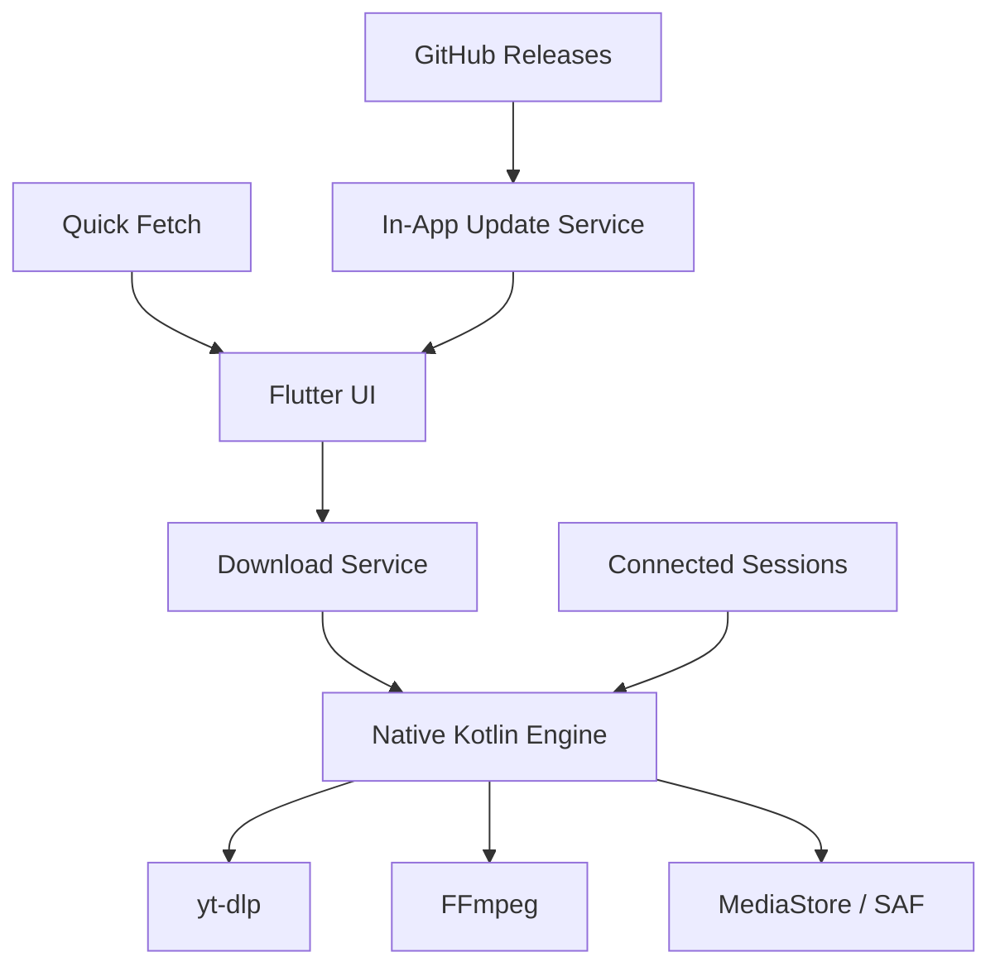

# Fetchy

A modern, local first media downloader for Android, built with Flutter and a native Kotlin download engine.

Fetchy is designed to keep the user experience simple while putting the heavy lifting in a native download pipeline powered by **yt-dlp** and **FFmpeg**.

> **Project status:** Early public release / active development.
>
> Fetchy is distributed as an APK and uses GitHub Releases as its update source.

## ✨ Features

- **Fast media fetching** from supported public links.
- **Video and audio selection** with format and quality choices based on the actual formats returned by yt-dlp.
- **Audio options** including conversion, metadata and optional artwork embedding.
- **Video options** including quality, FPS, subtitles and no-audio selection.
- **Download progress** with percentage, downloaded/total size, speed and selected format.
- **Download history** with search, filters, duplicate detection and missing-file state.
- **Quick Fetch** for detecting copied supported links through Android Accessibility events.
- **Connected Accounts / Sessions** with encrypted local cookie/session storage where supported.
- **Advanced `cookies.txt` import** for platforms that require a signed-in session.
- **Custom download locations** using Android storage APIs and SAF where available.
- **Error Information Center** with simple explanations plus sanitized technical details.
- **Diagnostics & Limitations** for advanced users and developers.
- **In-app updates** through GitHub Releases.
- **Arabic + English localization** with RTL support.
- **Privacy-first local architecture:** sessions and downloaded files are handled locally and are not uploaded by Fetchy as part of the normal download flow.

## 🧩 Supported Sources

Fetchy uses **yt-dlp** as its extraction/download engine. Actual availability depends on the source, media, authentication state and upstream extractor limitations.

The project currently includes workflows for sources such as:

- YouTube
- TikTok
- Instagram
- X / Twitter
- Snapchat

Some sources or individual posts may require a signed-in session, may expose limited formats, or may be blocked by platform-side restrictions. Fetchy intentionally does not bypass platform security or anti-bot protections.

For the current, detailed state of each platform, see **Settings → Diagnostics & Limitations** in the app.

## 🏗️ Architecture



### Main layers

**Flutter**

Handles the UI, media preview, selection, settings, history, diagnostics, sessions and update screens.

**Kotlin / Android**

Owns the download execution path, yt-dlp/FFmpeg integration, Android storage, MediaStore, FileProvider and APK installation.

**yt-dlp**

Performs extraction, format discovery and media downloading. Fetchy uses the bundled engine and its runtime update capability rather than maintaining individual site extractors inside the Flutter UI.

**FFmpeg**

Handles media processing such as merging/conversion and selected post-processing operations.

## 🔐 Privacy & Security

Fetchy is designed around local processing.

- Downloaded media is stored locally on the device.
- Saved sessions/cookies are encrypted locally using Android Keystore-backed storage.
- Session cookies are not sent to a Fetchy server.
- Update checks communicate with GitHub only to retrieve public release information and the selected APK asset.
- Technical diagnostics are sanitized and must not expose passwords, cookies, session values or other secrets.
- Android's normal package-signature verification remains in place for app updates.

Fetchy does **not** provide a way to silently install updates, bypass Android security checks, or bypass platform anti-bot protections.

## ⚠️ Limitations

Media extraction depends on the upstream yt-dlp engine and the target platform. Common limitations include:

- Sign-in or session requirements for restricted media.
- Platform-side anti-bot or challenge pages.
- Some high-quality formats requiring upstream tokens or platform-specific capabilities.
- Incomplete metadata such as unknown size, resolution or container information.
- Certain in-app OAuth/login flows may behave differently from the full external browser.

When possible, Fetchy explains these conditions through the normal error UI and exposes deeper information through **Developer Information / Diagnostics & Limitations**.

## 🛠️ Development Setup

### Requirements

- Flutter SDK (stable channel)
- Android Studio / Android SDK
- JDK compatible with the current Gradle/Android setup
- Android device or emulator

### Get the project

```bash
git clone <YOUR_REPOSITORY_URL>
cd fetchy
flutter pub get
```

### Run

```bash
flutter run
```

### Analyze & test

```bash
flutter analyze
flutter test
```

### Build debug APK

```bash
flutter build apk --debug
```

### Build release APK

```bash
flutter build apk --release
```

> A release build must be signed with the project's release keystore. Keep the keystore and signing secrets outside Git.

## 📦 Releases & In-App Updates

Fetchy uses **GitHub Releases** as its update distribution source. No custom update server is required.

The update flow is:

```text
GitHub Release
      ↓
Fetchy checks the latest stable release
      ↓
Compares versionName / versionCode
      ↓
Downloads the matching APK
      ↓
Validates package + version + signing certificate
      ↓
Opens Android Package Installer
```

When publishing a new release:

1. Update `version` in `pubspec.yaml`, including both version name and version code.
2. Build a **release-signed** APK.
3. Attach the APK to a stable GitHub Release.
4. Use a tag such as `v1.1.0+2`.
5. Keep the same release signing key for future versions.

Before the first public release, configure the GitHub owner/repository in the app's update configuration.

## 🧪 Testing Philosophy

Fetchy separates the download engine from presentation logic where practical so core behavior can be tested without requiring a physical device for every change.

Before a release, the project should pass:

```bash
flutter analyze
flutter test
```

and the Android native layer should compile successfully with the project's Gradle setup.

For release candidates, also test the real APK on a physical Android device, especially:

- media extraction and download
- session-based downloads
- storage locations
- Quick Fetch
- APK update/install flow

## 📁 Repository Guidelines

Do **not** commit sensitive or generated files such as:

- keystores / signing keys
- passwords, tokens or secrets
- exported cookies or session files
- local environment files containing credentials
- downloaded media
- build outputs
- IDE/user-specific files

Use the repository `.gitignore` and keep production secrets outside the source tree whenever possible.

## 🤝 Contributing

Fetchy is under active development. Bug reports, reproducible extraction issues and focused technical improvements are especially useful.

When reporting a downloader issue, include:

- source/platform
- whether the media is public or requires sign-in
- the Fetchy version
- relevant sanitized diagnostics/logs
- exact reproduction steps

Never attach passwords, authentication cookies, session exports or private account data.

## 📄 License

No open-source license has been selected yet.

Until a license is added to this repository, do not assume the source code is available for reuse, redistribution or commercial use.

## 🌐 Language Support

Fetchy supports:

- English
- Arabic (RTL)

The app can follow the device language, with Arabic selected automatically on Arabic-language devices.

## 🗺️ Roadmap

The project is evolving continuously. Areas of ongoing work include:

- broader format/platform compatibility
- improved diagnostics and reliability
- storage and download workflow refinements
- better release/update automation
- continued UI/UX refinement

---

**Fetchy** — simple on the surface, powerful underneath.
